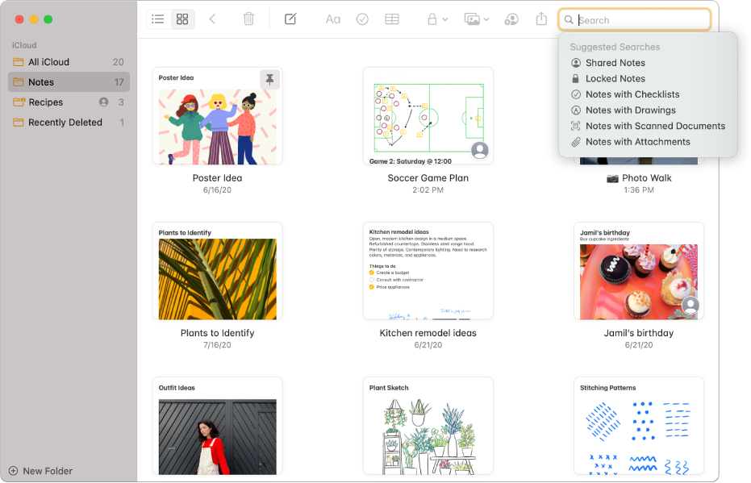
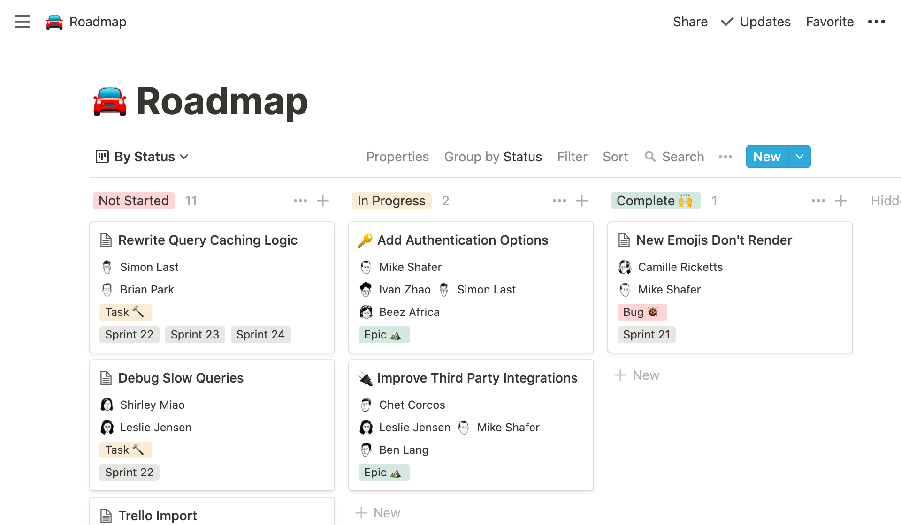

= Eindopdracht NOVI Frontend
:toc: macro

|======
| Instelling    | NOVI HBO Software Development
| Leerlijn      | FrontEnd 2021/03
| Document      | Functioneel Ontwerp voor de Eindopdracht
| Docent        | Nova Eeken / Rein op 't Land
| Datum         | 18 juli 2021
| Auteur        | Jurjen Vorhauer
| Email         | J.Vorhauer@novi-education.nl
| Studentnummer | 800009793
| GitHub        | https://github.com/jvorhauer/novi-frontend-eindopdracht
| *Noviaal*     | Een Twitterig platform, de naam is een samentrekking van NOVI en Sociaal
|======

<<<

toc::[]

<<<

Dit is het Functioneel Ontwerp (FO) van de eindopdracht van de NOVI HBO Software Development Frontend module.

In dit document zijn alle onderdelen, zoals beschreven in `Integrale Eindopdracht Frontend v2.3.pdf` @ https://edhub.novi.nl/study/learnpaths/432/documents opgenomen:

* __Probleem__stelling en __oplossing__ daarvoor
* Functionel en Niet-functionele __eisen__
* __Inspiratiebronnen__
* __Use Cases__ voor gebruikershandelingen
* __Wireframes__ (foto's van papier)
* Link naar Figma project met __prototype__.

<<<

== Probleemstelling

Er bestaan vele applicaties, websites en tools om aantekeningen of notities te maken en weer terug te lezen. De meeste van die tools beschikken over de mogelijkheid om zo'n notitie te delen met anderen. Aan de andere kant bestaan er sociale media applicaties, zoals Twitter en Facebook, waarmee notities gedeeld worden, maar verder niet echt als een notitie, maar meer als een dagboek-aantekening worden beschouwd: het is niet gebruikelijk dat een bestaande aantekening nog bijgewerkt wordt. Vergelijkbaar met een blog.

Noviaal is bedoeld als een tool die beide werelden gaat verenigen: uitgebreide notities met vele mogelijkheden om te bewerken en te verrijken. Wijzigingen worden gecommuniceerd aan volgers, zodat een nieuwe versie van de notitie ook aandacht kan krijgen. De notities zijn dus geen aantekening maar blijven leven.

Noviaal maakt het mogelijk voor geregistreerde gebruikers om aantekeningen, Notes, te maken, wijzigen, bekijken en verwijderen.
Dit is een eerste en nog beperkte versie. Latere versies zullen meer bewerkingsmogelijkheden gaan krijgen.

== Functionele eisen

Gebruikers moeten de volgende activiteiten kunnen uitvoeren:

* registreren als nieuwe gebruiker
* inloggen
* uitloggen

* nieuwe notitie aanmaken
* bestaande notitie wijzigen
* bestaande notitie verwijderen
* een overzicht van eigen notities
* een overzicht van notities van een andere gebruiker
* een overzicht van notities van alle gevolgde gebruikers

* een gebruiker volgen
*

== Niet-functionele eisen

== Inspiratiebronnen

=== Apple Notes

Simpel en doeltreffend, maar niet veel sociale aspecten:

=== Notion

Een zeer uitgebreide notitie applicatie met veel toeters en bellen. Ik vind deze app erg mooi, maar veel te uitgebreid (of complex) voro mijn doeleinden. Wel heel veel sociale aspecten, met name gericht op samenwerken.

=== Roam

== Use Cases

=== Authenticatie

[cols=">,"]
|===
| AC1 | Registreer nieuwe gebruiker

| Beschrijving
| Om alle functionaliteit van Noviaal te gebruiken moet een persoon eerst registreren

| Actoren
| Reader

| Voorwaarden
| Een persoon registreert met een uniek email adres, een naam en een wachtwoord

| Happy flow
| Een nog niet geregistreerde gebruiker maakt duidelijk dat hij of zij wil registreren. De aanstaande User voert een email adres in, een naam (geheel vrij, maar wel verplicht) en een password (twee maal). De nieuwe User wordt vastgelegd in de database. De nieuwe gebruiker kan meteen inloggen en aan de slag (om een afhankelijkheid van een email server of ander bevestigingssignaal kanaal te voorkomen).
|===

[cols=">,"]
|===
| AC2 | Login

| Beschrijving
| Een eerder geregistreerde gebruiker logt in door zijn of haar email adres en password in te voeren.

| Actoren
| User en Admin

| Voorwaarden
| Om in te kunnen loggen moet een User eerder geregistreerd zijn en de juiste combinatie van email adres en password invoeren

| Happy Flow
| Gebruiker voert email en password in en logt in

| Alternatieve flow
| Verkeerde email en/of password ingevoerd, de gebruiker keert terug naar een leeg inlog scherm met een foutmelding.

| *NB*
| van gebruikers wordt bijgehouden wanneer ze hebben ingelogd.
|===

[cols=">,"]
|===
| AC3 | Password vergeten

| Beschrijving
| Een eerder geregistreerde gebruiker is het password van het account vergeten. Het password wordt op verzoek gemaild naar het email adres van het account

| Actoren
| User en Admin

| Voorwaarden
| zelfde als inloggen

| Happy Flow
| De gebruiker geeft aan dat het password opgestuurd moet worden en dan wordt het password opgestuurd.

| *NB*
| Dit is onveilig. Zie ook de niet-functionele eisen: omdat de applicatie alleen lokaal draait en niet bedoeld is om publiekelijk te delen, is een complete en vergaande veiligheid niet een vereiste.
|===

[cols=">,"]
|===
| AC4 | Uitloggen

| Beschrijving
| een ingelogde gebruiker kan uitloggen en daarmee de lopende sessie beeindigen.

| Actoren
| User en Admin

| Voorwaarden
| de gebruiker is ingelogd

| Happy Flow
| Ingelogde gebruiker geeft aan dat uitgelogd moet worden. De gebruiker-sessie wordt beeindigd. De gebruiker is nu een Reader
|===

[cols=">,"]
|===
| AC5 | Forget Me (beeindig account)

| Beschrijving
| Indien een geregistreerde gebruiker geen account meer wil bij Noviaal dan kan dat account vergeten worden: ieder spoor van dat account wordt dan verwijderd uit de persistente opslag (de database).

| Actoren
| User

| Voorwaarden
| de gebruiker heeft een account en is ingelogd

| Happy Flow
| de ingelogde gebruiker geeft aan dat het account vergeten moet worden. Alle notities, likes, reminders en comments worden eerst verwijderd, waarna het account zelf uit de database verwijderd wordt. Ook de

| *NB*
| het email adres van het vergeten account kan daarna hergebruikt worden voor een nieuw account (met een nieuw id)
|===

[cols=">,"]
|===
| GC1 | Toon gebruiker

| Beschrijving
| Toon alle detailinformatie van een gebruiker

| Actoren
| Gebruiker

| Voorwaarden
| De gebruiker is ingelogd

| Happy Flow
| Vanuit bijv. zoekresultaten kan een gebruiker een (andere) gebruiker selecteren en daarvan de detailinformatie zien. Ook worden de notities van die gebruiker getoond.

| Alternatieve Flow
| een mogelijkheid wordt geboden aan ingelogde gebruikers om hun eigen details in te zien.
|===

=== Notities

[cols=">,"]
|===
| NC1 | Creer nieuwe notitie

| Beschrijving
| Maak een nieuwe Notitie en informeer alle volgers van dit feit

| Actoren
| Gebruikers: auteur en volgers.

| Voorwaarden
| Gebruiker is ingelogd.

| Happy Flow
| de gebruiker vult een titel en tekst in en geeft aan dat een nieuwe notitie aangemaakt moet worden. De applicatie slaat de notitie op in het permanente geheugen (database) en stuurt een event aan de volgers van de ingelogde gebruiker dat er een nieuwe notitie ter beschikking is.

| Alternative Flow
| het lukt niet om de nieuwe notitie in de database op te slaan: de auteur wordt geinformeerd over de fout, de volgers niet.

| Uitzondering
| Indien de auteur aangeeft dat de notitie privé is, dan worden volgers niet geinformeerd over deze notitie
|===

[cols=">,"]
|===
| NC2 | Lees een notitie

| Beschrijving
| Een gebruiker heeft een notitie geselecteerd uit de TimeLine (zie Use Case IC6) of uit zoek resultaten (zie Use Case IC3). De notitie wordt gepresenteerd met auteur, datum & tijd van aanmaken en datum & tijd van laatste wijziging en titel en body.

| Actoren
| Gebruiker

| Voorwaarden
| gebruiker is ingelogd en heeft een notitie gekozen

| Happy Flow
| een gevonden notitie wordt getoond
|===

[cols=">,"]
|===
| NC3 | Update een notitie

| Beschrijving
| Een auteur kan de titel en/of de body tekst van een bestaande notitie aanpassen en weer opslaan.

| Actoren
| Gebruiker (auteur en volgers)

| Voorwaarden
| gebruiker is ingelogd en heeft aangegeven, bijv. vanuit NC2, dat de betreffende notitie gewijzigd gaat worden

| Happy Flow
| gebruiker wijzigt titel en/of body tekst en slaat deze op in de databse, volgers worden geinformeerd.

| Alternate Flow
| gebruiker geeft aan de wijzigingsactie niet uit te willen voeren (cancel)

| Uitzondering
| Indien de auteur aangeeft dat de notitie privé is, dan worden volgers niet geinformeerd over deze notitie
|===

[cols=">,"]
|===
| NC4 | Verwijder notitie

| Beschrijving
| Een auteur kan een bestaande notitie verwijderen

| Actoren
| Gebruiker (auteur)

| Voorwaarden
| gebruiker is ingelogd en heeft een notitie geselecteerd

| Happy Flow
| de gebruiker geeft aan de notitie te willen verwijderen; de notitie, commentaar, likes en reminders woorder uit de permanente opslag (database) verwijderd.
|===

[cols=">,"]
|===
| NC5 | Tag notitie

| Beschrijving
| Een auteur kan een notitie voorzien van één of meer tags

| Actoren
| gebruiker (auteur)

| Voorwaarden
| gebruiker is ingelogd en heeft een notitie geselecteerd

| Happy Flow
| gebruiker kiest één of meer tags uit de lijst van beschikbare tags en geeft aan deze selectie bij de notitie te willen opslaan. De keuze voor 0 of meer tags wordt opgeslagen in de permanente opslag (database).

| *NB*
| er wordt een beperkt aantal tags beschikbaar gesteld in Noviaal. In een latere versie kan dat aantal veranderen en/of onderhoudbaar gemaakt worden.
|===

=== Interactie

[cols=">,"]
|===
| IC1 | Follow (volg)

| Beschrijving
| Een gebruiker kan een andere gebruiker gaan volgen. De volgende gebruiker wordt op de hoogte gehouden van nieuwe en gewijzigde notities van de gevolgde gebruiker

| Actoren
| Gebruiker (volger en gevolgde)

| Voorwaarden
| gebruiker die wil gaan volgen is ingelogd en heeft een andere gebruiker geselecteerd.

| Happy Flow
| Uit de zoekresultaten of via de auteur-link van een notitie is een te volgen gebruiker geselecteerd. De gebruiker geeft aan dat deze gebruiker gevolgd moet gaan worden.
|===

[cols=">,"]
|===
| IC2 | Unfollow (beeindig volgen)

| Beschrijving
| Een gebruiker kan een andere, gevolgde gebruiker unfollowen, waardoor deze gebruiker niet meer op hoogte wordt gehouden van events van die gebruiker

| Actoren
| Gebruiker (volger, gevolgde)

| Voorwaarden
| Gebruiker is ingelogd en volgt de andere gebruiker

| Happy Flow
| De gebruiker geeft aan de gevolgde gebruiker niet meer te willen volgen. Dit kan bijv. vanaf OC5
|===

[cols=">,"]
|===
| IC4 | Like

| Beschrijving
| 'Like' een getoonde notitie

| Actoren
| Gebruiker

| Voorwaarden
| Gebruiker is ingelogd en heeft een notitie geselecteerd (middels NC2)

| Happy Flow
| De gebruiker geeft aan dat een getoonde notitie ge-liked moet worden. Noviaal slaat deze keuze op in de database.
|===

[cols=">,"]
|===
| IC5 | Unlike

| Beschrijving
| Stop met 'like'n van een notitie

| Actoren
| Gebruiker

| Voorwaarden
| gebruiker is ingelogd en heeft een gelikede notitie geselecteerd

| Happy Flow
| De gebruiker geeft aan dat de getoonde, gelikede notitie niet meer geliked hoeft te worden. Noviaal verwijdert de like uit de database.
|===

[cols=">,"]
|===
| IC6 | TimeLine

| Beschrijving
| Toon notities van gevolgde gebruikers en eigen notities op volgorde van laatste wijzigingsdatum.

| Actoren
| Gebruiker, Reader

| Voorwaarden
| Geen

| Happy Flow
| Dit is 'home' voor alle gebruikers en readers: meest recente notities bovenaan.
|===

=== Overzicht

[cols=">,"]
|===
| OC2 | Eigen notities

| Beschrijving
| De eigen notities worden getoond op het detailinformatie scherm van de ingelogde gebruiker

| Actoren
| Gebruiker

| Voorwaarden
| Gebruiker is ingelogd en heeft gekozen voor het tonen van zijn eigen profiel (GC1)

| Happy Flow
| Alle eigen notities worden getoond, volgorde kan op datum/tijd of titel zijn.

| Alternatieve Flow
| Als de huidige gebruiker nog geen notities heeft, dan wordt dat gemeld.
|===

[cols=">,"]
|===
| OC3 | Liked notities

| Beschrijving
| Toon alle notities die de huidige gebruiker heeft geliked

| Actoren
| Gebruiker

| Voorwaarden
| Gerbuiker is ingelogd

| Happy Flow
| De notities die geliked zijn door de huidige gebruiker worden getoond

| Alternatieve Flow
| Als er nog geen gelikede notities zijn, dan wordt dat gemeld.
|===

[cols=">,"]
|===
| OC5 | Gevolgden

| Beschrijving
| Toon een lijst met alle gebruikers die de ingelogde gebruiker volgen

| Actoren
| Gebruiker (auteur, volgers)

| Voorwaarden
| De gebruiker is ingelogd

| Happy Flow
| De gebruiker kiest voor de lijst met volgers. Van iedere volger op de lijst zijn de details in te zien

| Alternatieve flow
| Als nog niemand gevolgd wordt, dan wordt dat gemeld.
|===

<<<

== Niet-Functionele Eisen

=== Kwaliteit

Het project zal alleen release versies van gebruikte dependencies gebruiken. Deze dependencies zullen actief gecheckt worden, zodat mogelijke (veiligsheid) fouten direct opgelost worden, zodra een verbeterde versie ter beschikking is. Hiervoor wordt gebruik gemaakt van DependaBot van GitHub.

Door het gebruik van Continuous Integration (CI) om het project te bouwen, iedere keer dat er een update gepushed wordt, is de kwaliteitsbewaking continue.

=== Internet

De Noviaal Applicatie kan lokaal op een PC of laptop gedraaid worden, maar een internet verbinding is noodzakelijk.

Voor het bouwen van het project tot een werkende applicatie is een internet verbinding nodig. De build tool (Maven) gaat de dependencies van repositories op internet ophalen.

Aangezien er van Docker compose gebruik gemaakt gaat worden om de database en de applicatie op te starten, is er eenmalig
een internet verbinding nodig om de PostgreSQL image en een standaard Linux image met Java te downloaden.

Dus: voor bouwen en installeren is wel een internet verbinding nodig, voor het draaien van de Noviaal applicatie is geen internet verbinding nodig.

=== Veiligheid

Zolang de applicatie alleen lokaal gedraaid gaat worden is het niet nodig om SSL voor hhtps in te richten en is ook MultiFactor Authenticatioon (MFA) niet nodig.
Inloggen is bedoeld om onderscheid te kunnen maken tussen de verschillende gebruikers, zodat de interactie tussen die gebruikers zichtbaar gemaakt kan worden.

=== Performance

Er zijn geen eisen gesteld aan de performance van het systeem. Er wordt dan ook vanuit gegaan dat er voldoende CPU en intern geheugen (RAM) in de machine waarop de Noviaalfrontend applicatie gedraaid wordt, aanwezig zijn.

Ook voor response tijden zijn geen eisen gegeven. Er zijn dus geen performance tests, laat staan performance optimalisaties gepland voor de Noviaal frontend.

=== Data recovery

Er is geen backup van de notities geïmplementeerd of gepland.

== Wireframes

== Prototype
